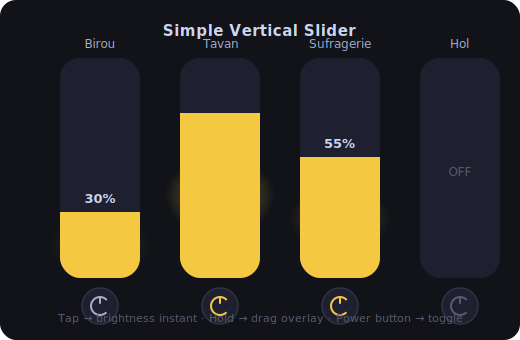

# Simple Vertical Slider

A minimalist Home Assistant card that displays vertical brightness sliders for your lights — one column per light, clean and touch-friendly.




## Installation via HACS

1. Go to **HACS → Frontend → ⋮ → Custom repositories**
2. Add this repository URL and select category **Lovelace**
3. Install **Simple Vertical Slider** and reload the browser

---

## Manual Installation

1. Copy `simple-vertical-slider.js` to `config/www/`
2. In HA go to **Settings → Dashboards → Resources** and add:
   - URL: `/local/simple-vertical-slider.js`
   - Type: **JavaScript module**
3. Hard-refresh the browser (Ctrl + Shift + R)

---

## Configuration

### Visual editor

Click **+ Add card**, search for **Simple Vertical Slider**, and use the built-in GUI editor to add/remove/reorder lights.

### YAML

```yaml
type: custom:simple-vertical-slider
entities:
  - entity: light.birou
    name: Birou
  - entity: light.tavan
    name: Tavan
  - entity: light.sufragerie
    name: Sufragerie
```

| Option | Type | Required | Description |
|--------|------|----------|-------------|
| `entities` | list | ✅ | List of light entities |
| `entities[].entity` | string | ✅ | Entity ID (must be a `light.*`) |
| `entities[].name` | string | ❌ | Display name (falls back to entity friendly name) |

---

## License

MIT
